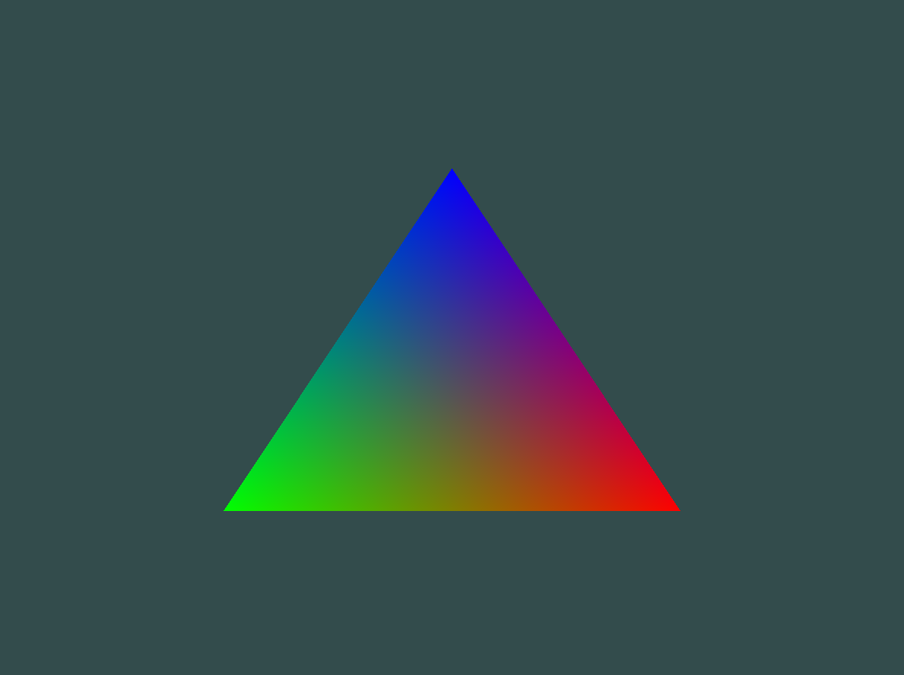

# OpenGL

Learning OpenGL through [LeanOpenGL](https://learnopengl.com) and The Cherno's Youtube Channel.

## Showcase


<video src="./assets/showcase.mp4" poster="./assets/showcase.png" autoplay loop muted controls style="max-width:100%"></video>


## Prerequisites

- CMAKE
- OpenGL

```sh
# Install OpenGL
sudo pacman -S opengl
```

### Build

```shell
cmake -B build && cmake --build build --target run
```

Or just create an alias:

```shell
alias run='cmake -B build && cmake --build build --target run'
```


### Debugging

On `CLion` before running the program, set the working directory in CLion's run configuration:

1. Go to Run → Edit Configurations…
2. Select your opengl target
3. Set Working directory to: \$ProjectFileDir\$