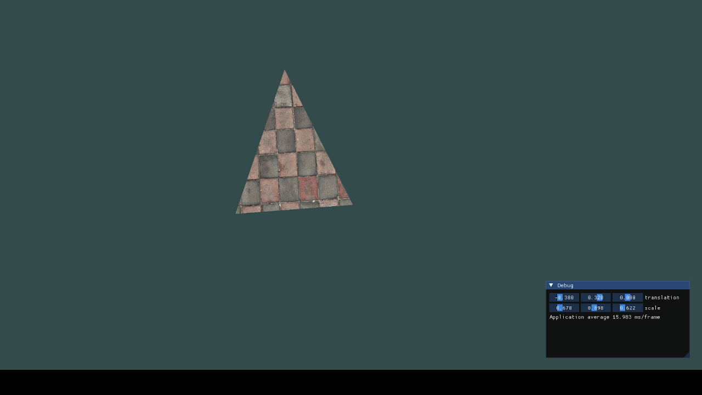

# OpenGL

Learning OpenGL through [LeanOpenGL](https://learnopengl.com) and The Cherno's Youtube Channel.

## Showcase



## Prerequisites

- CMAKE
- OpenGL

```sh
# Install OpenGL
sudo pacman -S opengl cmake
```

### Build

```shell
cmake -B build && cmake --build build --target run
```

Or just create an alias:

```shell
alias run='cmake -B build && cmake --build build --target run'
```


### Debugging

### Clion
On `CLion` before running the program, set the working directory in CLion's run configuration:

1. Go to Run → Edit Configurations…
2. Select your opengl target
3. Set Working directory to: \\$ProjectFileDir\\$

### Zed

1. Install `lldb`
```sh
sudo pacman -S lldb
```

2. Rebuild with DEBUG symbols
```sh
cmake -B build -DCMAKE_BUILD_TYPE=Debug && cmake --build build -j --target run
```

3. Run it in `Zed`
a. 